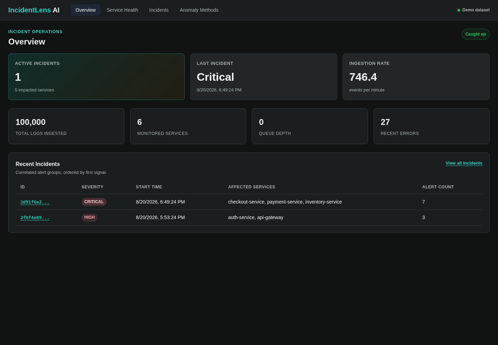
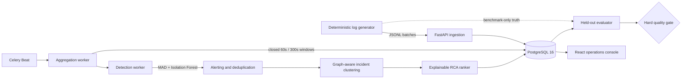

# IncidentLens AI

[](https://github.com/meher4567/incidentlens-ai/actions/workflows/ci.yml)
[](https://github.com/meher4567/incidentlens-ai/actions/workflows/codeql.yml)
[](https://www.python.org/)
[](LICENSE)

IncidentLens turns raw microservice logs into operator-ready incidents. It builds
event-time metrics, detects anomalies, suppresses duplicate alerts, reconstructs
cross-service cascades, and ranks likely root causes with inspectable feature
contributions.

This is a working distributed system with a deterministic evaluation protocol,
not a dashboard wrapped around static predictions.



## Verified results

The following results were reproduced on 20 August 2026 using PostgreSQL 16,
Python 3.13, the deterministic seed-42 scenario, and the repository's hard
quality gate:

| Measure | Result | Enforced gate |
|---|---:|---:|
| MAD recall / false-positive rate | 84.0% / 2.12% | ≥80% / ≤5% |
| MAD precision / F1 | 79.25% / 81.55% | F1 ≥75% |
| Isolation Forest recall / false-positive rate | 84.0% / 5.77% | ≥75% / ≤8% |
| Alert compression | 65.5% (173/264 suppressed) | 40–90% |
| Held-out RCA top-1 / top-3 | 83.33% / 100% (n=6) | ≥75% / ≥90% |
| Batch ingestion | 7,746 logs/s, 0/20,000 errors | ≥250 logs/s, zero errors |
| Slowest measured dashboard endpoint p95 | 15.0 ms | ≤250 ms |

These are controlled local measurements, not universal production-capacity
claims. The held-out RCA set is deliberately small and reports a wide 95%
interval; see [benchmark methodology](docs/benchmark_results.md) for the
protocol and limitations.

## Why the system is interesting

- **Event-time correctness:** deterministic eight-hour traffic, watermark-based
  closed windows, rolling median/MAD baselines, and no wall-clock leakage.
- **Honest ML lifecycle:** 12 labeled training incidents and 6 distinct
  held-out incidents; model artifacts are only loaded with matching registry
  metadata.
- **Noise reduction before RCA:** debounce plus deterministic graph/trace-aware
  union-find deduplication keeps suppressed evidence attached to incidents.
- **Explainable root cause ranking:** logistic regression stores candidate
  scores, feature vectors, and per-feature contributions.
- **Operational workflow:** incident briefings include impact, evidence,
  recommended actions, timeline, and a copyable Markdown handoff.
- **Production boundaries:** API-key protection for mutations, request limits,
  Redis-backed ingestion throttling, request IDs, security headers, Prometheus
  metrics, readiness probes, non-root backend containers, and private data
  services.
- **Fail-closed delivery:** branch coverage ≥80%, Python 3.11/3.13 matrix,
  migration drift detection, dependency audits, CodeQL, container builds, and
  the real 40k-event quality gate in CI.

## Architecture



The generated dependency graph is intentionally small enough to inspect:

```text
api-gateway
├── auth-service
└── checkout-service
    ├── payment-service
    ├── inventory-service
    └── notification-service
```

See [architecture](docs/architecture.md) for component contracts, invariants,
schema ownership, and failure behavior.

## Try it

### Frontend-only product tour

```bash
cd frontend
npm ci
VITE_DEMO_MODE=true npm run dev
```

Demo mode is visibly labeled and uses deterministic sample data. It is for
product review only and is never used as backend benchmark evidence.

### Full end-to-end pipeline

Prerequisites: Docker Compose, Python 3.11+, and Node 22+.

```bash
python -m venv .venv
. .venv/bin/activate
pip install -r backend/requirements-dev.txt
cd frontend && npm ci && cd ..

make demo
```

Open `http://localhost:5173`. The command starts infrastructure, migrates the
schema, generates 100k events, runs aggregation/detection/dedup/clustering,
trains both model families, and scores incidents.

### Production-shaped Compose stack

```bash
export POSTGRES_PASSWORD="$(openssl rand -hex 24)"
export API_KEY="$(openssl rand -hex 32)"
docker compose -f compose.prod.yml up -d --build
```

The dashboard is served on `http://localhost:8080`; PostgreSQL, Redis, and the
API remain on the private Compose network. See the
[deployment runbook](docs/deployment.md).

## Quality gates

```bash
# Backend: 68 tests, branch coverage gate, lint, types, dependency audit
make test
make lint
pip-audit -r backend/requirements.txt

# Frontend: tests, lint, production bundle, dependency audit
cd frontend
npm test
npm run lint
npm run build
npm audit --audit-level=moderate

# Database and deterministic ML protocol
cd ..
python -m alembic upgrade head
python -m alembic check
python -m benchmarks.quality_gate
```

The ML gate expects a seeded and processed deterministic dataset. The exact
clean-room sequence used by CI is in
[the workflow](.github/workflows/ci.yml).

## Repository map

| Path | Responsibility |
|---|---|
| `backend/app/api` | Ingestion, query, health, incident, and evaluation APIs |
| `backend/app/services` | Aggregation, detection, deduplication, clustering, RCA |
| `worker` | Celery scheduling, routing, retries, and task chaining |
| `generator` | Deterministic traffic and labeled incident scenarios |
| `benchmarks` | Fail-closed detection, dedup, RCA, load, and latency checks |
| `frontend` | Responsive React incident-operations console |
| `alembic` | Versioned schema and operational indexes |
| `docs` | Design decisions, runbooks, evidence, and project limits |

## Documentation

- [Architecture and data flow](docs/architecture.md)
- [Benchmark protocol and evidence](docs/benchmark_results.md)
- [Incident walkthrough](docs/incident_walkthrough.md)
- [Anomaly methods](docs/anomaly_methods.md)
- [RCA methodology](docs/ablation_findings.md)
- [Deployment runbook](docs/deployment.md)
- [UX and accessibility audit](docs/ux_audit.md)
- [Contributing](CONTRIBUTING.md) and [security policy](SECURITY.md)

## Scope

IncidentLens uses synthetic telemetry so ground truth is exact and evaluation is
reproducible. It does not claim that six held-out incidents represent every
production failure mode. The next research step is replaying anonymized public
traces or a larger topology while preserving the same train/held-out boundary.

Licensed under the [MIT License](LICENSE).
