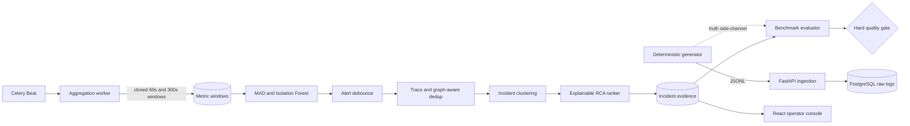

# IncidentLens AI — Architecture

IncidentLens is a small, production-shaped observability pipeline. Its main
design constraint is evidence integrity: generated truth is available to
training and benchmark code, but never to detection, alerting, clustering, or
the dashboard.

## Data flow



The dependency direction is caller to dependency:

```text
api-gateway
├── auth-service
└── checkout-service
    ├── payment-service
    ├── inventory-service
    └── notification-service
```

## Runtime components

| Component | Contract | Failure behavior |
|---|---|---|
| Generator | Seeded, fixed event-time range and deterministic IDs | Same seed/config/event count produces byte-identical files |
| Ingestion API | Validates batches of at most 1,000 logs and resolves services once per batch | Transaction rolls back and returns 503 on database failure |
| Aggregator | Upserts 60s/300s windows behind a per-service watermark | Only closed windows are materialized; retries are idempotent |
| Detector | MAD for three metrics; one multivariate IF score per 300s window | Missing or stale IF artifacts are skipped, never silently substituted |
| Alerting | Event-time debounce keyed by service and anomaly type | Replays extend one alert rather than multiplying alerts |
| Deduplication | Deterministic union-find over time, shared traces, and graph context | Suppressed alerts remain linked as evidence |
| Clusterer | Groups canonical alerts by time proximity and graph adjacency | Incident duration is bounded; repeat runs do not duplicate membership |
| RCA | Logistic regression ranks every attached candidate service | No model or insufficient candidates fails explicitly |
| Evaluator | Service-aware overlap and global one-to-one truth matching | Any missing slice or sub-threshold metric fails the gate |

## Event-time and ML invariants

- Scenario v2 covers a fixed eight-hour UTC interval beginning
  `2026-01-01T00:00:00Z`; event count changes density, not incident placement.
- The dataset contains 12 training incidents across three known types and six
  held-out incidents across two distinct types. `notification-service` appears
  only as a held-out root cause.
- Truth records include seed and scenario provenance. They are loaded for RCA
  training and evaluation only.
- Aggregation excludes the partially observed final window and advances a
  watermark only after successful writes.
- MAD baselines use the 30 previous closed windows. Floors are 0.01 for error
  rate, 5 ms for p95 latency, and one request for volume.
- Isolation Forest is trained per service on truth-labeled normal 300-second
  windows with the features `request_count`, `error_rate`, `p95_latency_ms`,
  and `unique_messages`.
- Evaluation converts windows to service-aware detections and performs a
  deterministic one-to-one match, preventing one alert from satisfying
  multiple truth incidents.

## RCA model

The ranker uses balanced logistic regression. For each incident/service pair it
persists the score, rank, input feature vector, and per-feature contribution.

| Feature | Signal |
|---|---|
| `is_earliest` | Whether this service emitted the first incident alert |
| `earliest_seconds_gap` | Delay from the incident's first alert |
| `upstream_position` | Affected downstream services reachable in the incident |
| `blast_radius` | Reachable downstream services in the complete graph |
| `metric_jump_magnitude` | Largest absolute MAD score attached to the service |
| `alert_count` | Canonical and suppressed evidence attached to the service |

## Persistence and indexing

| Table | Ownership and important key |
|---|---|
| `services`, `service_dependencies` | Service catalog and directed graph |
| `raw_logs` | Immutable normalized events; service/time and trace indexes |
| `metric_windows` | Unique service/window-size/window-start aggregate |
| `anomalies` | Unique detector/metric/window result |
| `alerts`, `deduplicated_alerts` | Canonical alert and suppression edges |
| `incidents`, `incident_alerts` | Incident state and evidence membership |
| `incident_root_cause_scores` | Candidate ranking and explanations |
| `incident_truth` | Benchmark/training-only labels with provenance |
| `watermark` | Per-service/window-size processing position |
| `internal_metrics` | Pipeline run and diagnostic measurements |

Alembic is the schema authority. CI upgrades a fresh PostgreSQL 16 database and
runs `alembic check` to reject ORM/migration drift. Integer primary keys use a
PostgreSQL `BIGINT` and a SQLite-compatible variant for fast unit tests.

## API and operational boundaries

- `GET /healthz` is process liveness and performs no dependency I/O.
- `GET /api/ready` checks the database required to serve the product.
- `GET /api/health` reports database and Redis status; Redis degradation is
  visible but does not fail readiness because query traffic can still operate.
- `GET /metrics` exposes internal Prometheus counters, latency histograms, and
  in-flight gauges on the private API network.
- Mutating `/api/*` routes require `X-API-Key` when configured. Ingestion also
  enforces body size and a Redis-backed per-identity rate limit.
- Every response carries a request ID, processing time, content-type protection,
  frame denial, referrer policy, and restrictive permissions policy.
- Synchronous SQL endpoints are normal FastAPI `def` handlers so blocking ORM
  work runs in the thread pool rather than on the event loop.

Production Compose keeps PostgreSQL, Redis, the API, and `/metrics` private.
Nginx serves the SPA, provides its own `/healthz`, and proxies `/api` over the
internal network. Backend containers are non-root, read-only, capability-free,
and start only after the one-shot migration job succeeds.

## Deliberate boundaries

- Synthetic telemetry gives exact labels but is not evidence of production
  accuracy or capacity.
- The demo graph is intentionally small enough to inspect in an interview.
- The ranker learns from 12 incidents; the six-incident held-out interval is
  reported with uncertainty rather than presented as a broad ML claim.
- Redis rate limiting is fail-open for availability after authentication. A
  public multi-tenant deployment should put an additional fail-closed quota at
  the ingress or API gateway.
