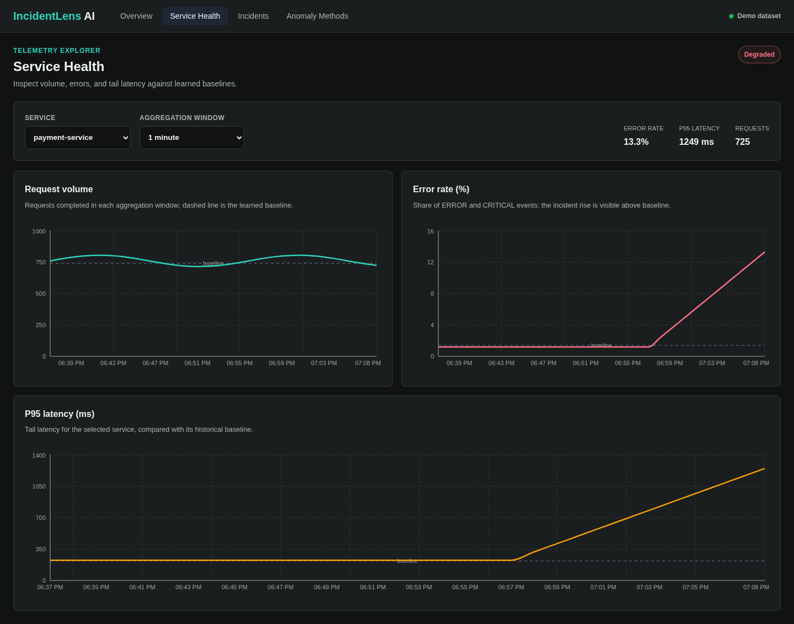
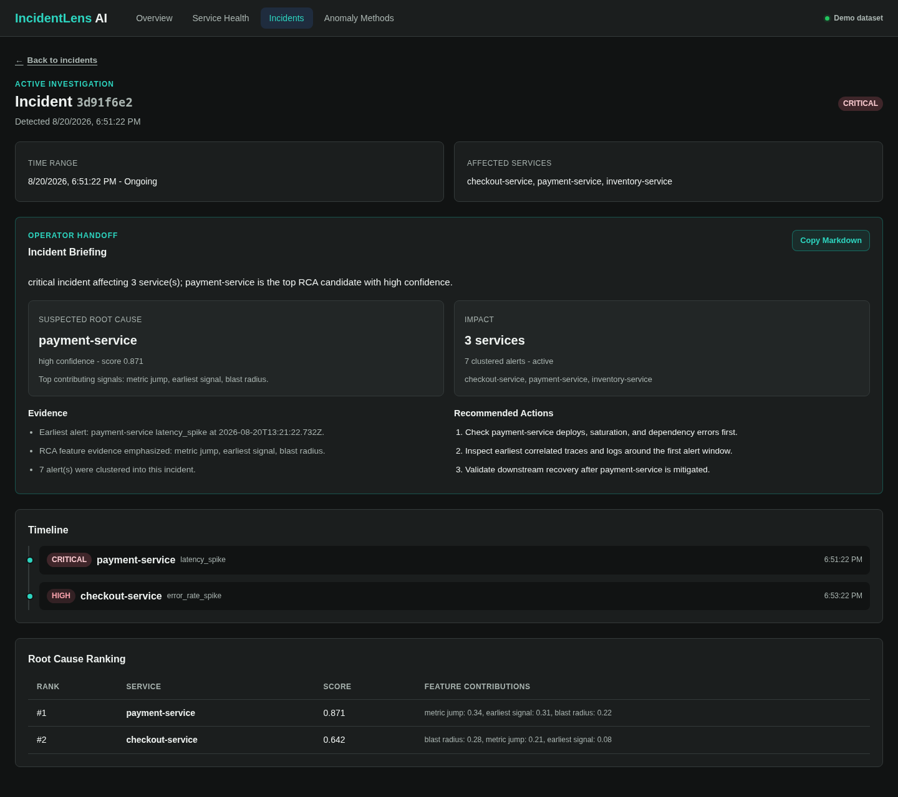
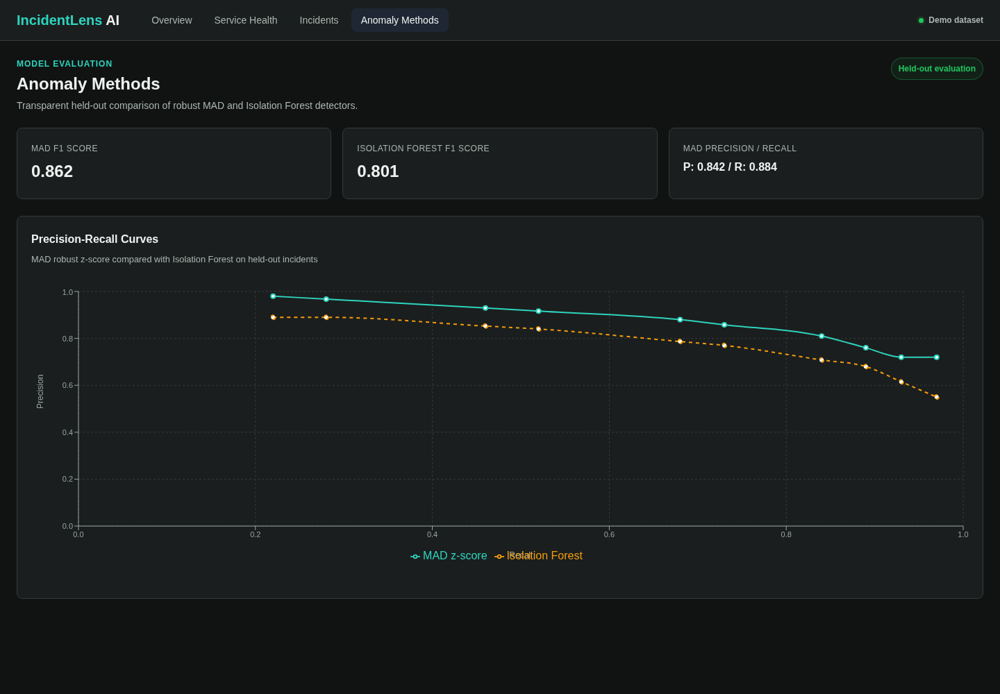

# UX and Accessibility Audit

Audit date: 20 August 2026

Surface: deterministic frontend demo mode

Desktop viewport: 1440 × 1000; mobile viewport: 390 px wide

This audit captured each core workflow before making changes, then repeated the
same routes after implementation. The curated screenshots below are the final
state; raw before/after browser artifacts are intentionally excluded from Git.

## 1. Operational overview — healthy

The screen now opens with a concise operational summary and a single set of
non-duplicated status cards. The pipeline status is distinct from incident
severity, the recent-incident table has a caption and column scopes, and the
primary follow-up route is obvious. The persistent badge labels demo data so a
reviewer cannot mistake a visual preview for a live pipeline run.

## 2. Service health investigation — healthy

The first service is selected automatically, metric context and current values
appear above the charts, and all three plots use explicit high-contrast colors,
reference baselines, numeric axes, and accessible labels. The 1-minute/5-minute
control remains visible and keyboard reachable.

## 3. Incident triage and handoff — healthy

The detail page prioritizes an operator briefing, suspected cause, impact,
evidence, and next actions before the lower-level timeline. A back link restores
orientation, the long internal identifier is visually shortened, and the
Markdown handoff is an explicit action. Duplicate severity treatment was
removed. Timeline and ranking tables have captions, scoped headers, and
keyboard-scrollable overflow regions.

## 4. Detector comparison — healthy with data caveat

The previously blank curves now render from merged threshold samples with
linear interpolation. Axes, series names, summary statistics, detector copy,
and chart labels make the comparison interpretable without relying on color
alone. This screen is only as meaningful as the controlled benchmark dataset;
it is not a production-accuracy claim.

## Cross-cutting checks

| Area | Result |
|---|---|
| Navigation | Semantic navigation, active-page state, working logo/home route, and 404 fallback |
| Keyboard | Skip link, visible focus, reachable controls, and focusable table overflow regions |
| Responsive layout | 390 px incident flow has no document-level horizontal overflow; wide evidence tables scroll locally |
| Motion | Chart animation is disabled and reduced-motion preferences are respected |
| Contrast | Muted text, statuses, focus rings, and chart series were raised to readable contrast |
| Semantics | One page-level heading, descriptive sections, table captions/scopes, and chart ARIA labels |
| Truthfulness | Demo/live data source is always visible in the shell |

## Remaining limitations

- Recharts exposes chart summaries to assistive technology, but a full tabular
  representation of every plotted point would improve non-visual analysis.
- The review used automated browser interaction and visual inspection; it did
  not include a screen-reader session or testing with disabled JavaScript.
- Demo mode validates presentation and workflow only. Backend behavior is
  covered separately by integration, benchmark, and production-stack checks.
- The dashboard does not yet implement authenticated user roles; production
  read authorization is a deployment boundary documented in `SECURITY.md`.

## Acceptance criteria

The audited flow is accepted because all primary routes render meaningful data,
the incident investigation path is complete, the prior blank-chart defects are
fixed, desktop and mobile layouts are usable, and the outstanding limitations
are explicit rather than hidden.
